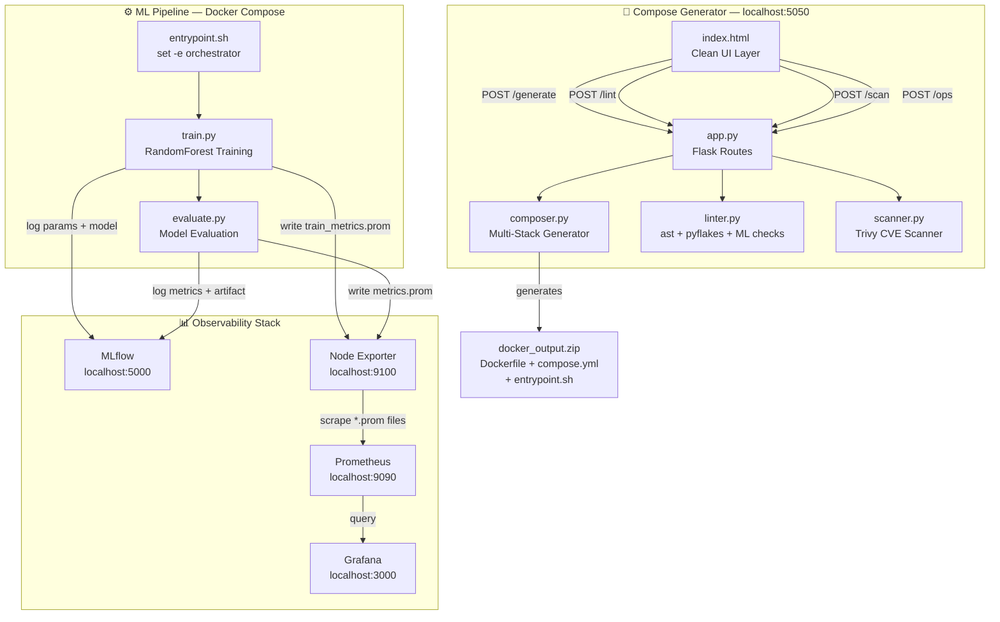
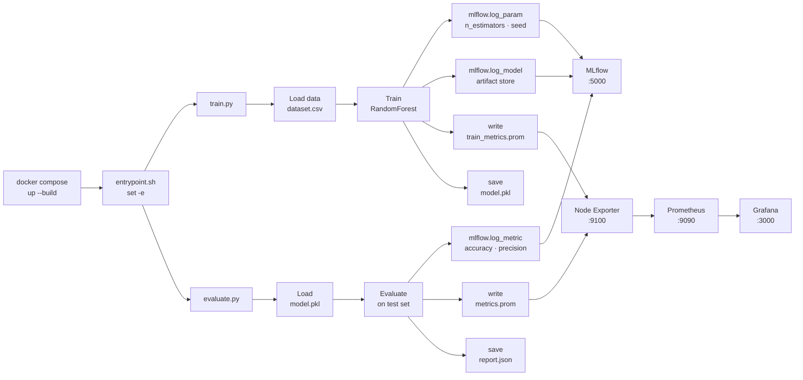
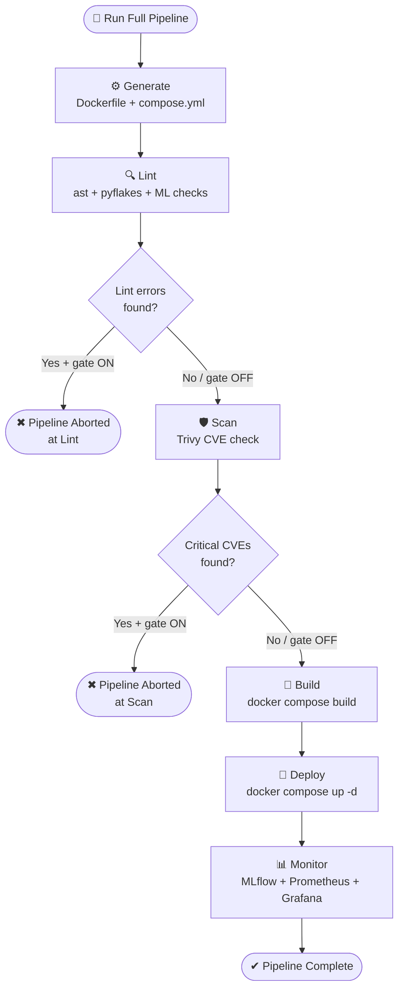
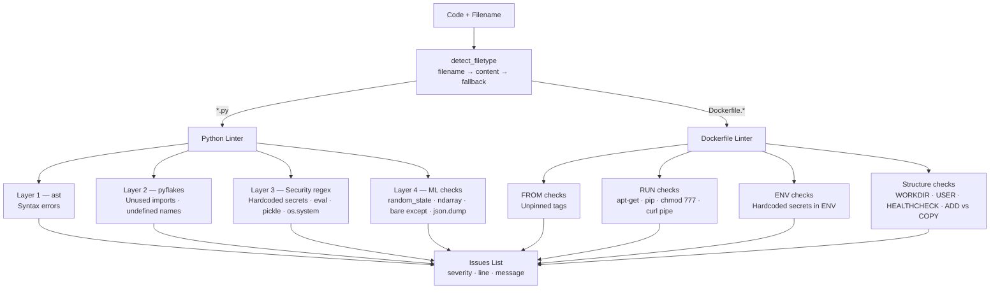
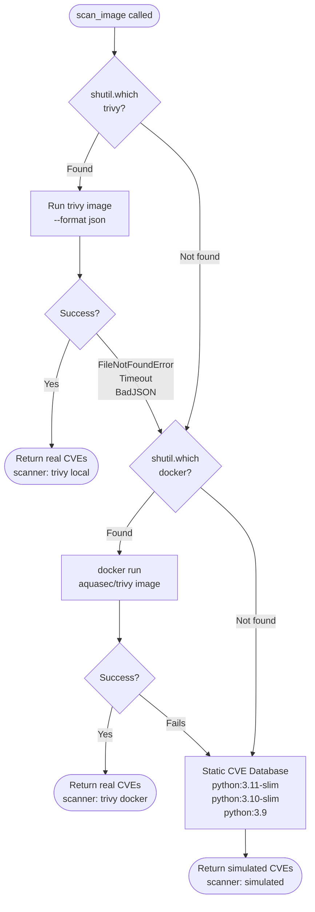

# MLOps Pipeline — Docker Compose Generator & Observability Stack

A production-grade MLOps toolkit that combines a multi-stack Docker Compose generator with a fully containerized ML pipeline, experiment tracking, and observability. Built to demonstrate end-to-end MLOps practices — from containerization and code quality gates to model versioning and metrics dashboards.

---

## Table of Contents

- [Overview](#overview)
- [Architecture](#architecture)
- [Project Structure](#project-structure)
- [Components](#components)
  - [Docker Compose Generator](#docker-compose-generator)
  - [ML Pipeline](#ml-pipeline)
  - [MLflow — Experiment Tracking](#mlflow--experiment-tracking)
  - [Prometheus + Node Exporter](#prometheus--node-exporter)
  - [Grafana](#grafana)
  - [Code Linter](#code-linter)
  - [Image Vulnerability Scanner](#image-vulnerability-scanner)
  - [One-Click OPS](#one-click-ops)
- [Bugs Fixed](#bugs-fixed)
- [Getting Started](#getting-started)
- [Services & Ports](#services--ports)
- [Future Scope](#future-scope)

---

## Overview

This project was built for generating Docker configurations for ML pipelines. The system comprises of:

- Multi-stack Dockerfile generation (Python, Node.js, PHP, Ruby, Go)
- A containerized ML training + evaluation pipeline
- MLflow experiment tracking and model versioning
- Prometheus + Grafana observability with auto-provisioned dashboards
- A real Python and Dockerfile linter with security checks
- A Trivy-backed image vulnerability scanner
- A One-Click OPS pipeline with configurable quality gates

---

## Architecture

### System Overview



---

### ML Pipeline Data Flow



---

### One-Click OPS Pipeline



---

### Linter Architecture



---

### Scanner Fallback Chain



---

## Project Structure

```
Evaluation-task/src/
│
├── compose_generator/              # Flask web app — localhost:5050
│   ├── app.py                      # Routes: /generate /lint /scan /ops /stack-defaults
│   ├── requirements.txt            # flask · pyflakes
│   ├── templates/
│   │   └── index.html              # Pure UI — no business logic
│   └── generator/
│       ├── __init__.py
│       ├── composer.py             # Multi-stack Dockerfile + compose generator
│       ├── linter.py               # Python + Dockerfile linter
│       ├── scanner.py              # Trivy scanner with fallback DB
│       └── entrypoint.sh           # Bundled into generated zip
│
└── ml_pipeline/                    # Containerized ML pipeline
    ├── Dockerfile                  # Generated by compose_generator
    ├── docker-compose.yml          # 5 services
    ├── prometheus.yml              # Scrape config — node-exporter:9100
    ├── entrypoint.sh               # set -e · train.py · evaluate.py
    ├── train.py                    # Train · log to MLflow · write train_metrics.prom
    ├── evaluate.py                 # Evaluate · log to MLflow · write metrics.prom
    ├── requirements.txt            # sklearn · pandas · numpy · mlflow · prometheus_client
    ├── data/
    │   └── dataset.csv
    ├── models/                     # model.pkl (volume mounted to host)
    ├── reports/                    # report.json · *.prom files (volume mounted to host)
    ├── mlruns/                     # MLflow experiment data (volume mounted to host)
    └── grafana/
        ├── provisioning/
        │   ├── datasources/
        │   │   └── prometheus.yml  # Auto-configure Prometheus data source
        │   └── dashboards/
        │       └── dashboard.yml   # Auto-load dashboard on startup
        └── dashboards/
            └── ml_pipeline.json    # 6-panel Grafana dashboard
```

---

## Components

### Docker Compose Generator

A Flask web app that generates production-ready Docker configurations for any project stack.

**Supported stacks:**

| Stack | Base Image | Dependency File | Install Command |
|-------|-----------|-----------------|-----------------|
| 🐍 Python | `python:3.11-slim` | `requirements.txt` | `pip install --no-cache-dir -r requirements.txt` |
| 🟢 Node.js | `node:20-slim` | `package*.json` | `npm install --production` |
| 🐘 PHP | `php:8.2-fpm` | `composer.json` | `composer install --no-dev` |
| 💎 Ruby | `ruby:3.2-slim` | `Gemfile` | `bundle install` |
| 🔵 Go | `golang:1.21-alpine` | `go.mod` | `go mod download` |

**Routes:**

| Route | Method | Description |
|-------|--------|-------------|
| `/` | GET | Render the control panel UI |
| `/generate` | POST | Generate and download `docker_output.zip` |
| `/lint` | POST | Lint Python or Dockerfile code |
| `/scan` | POST | Scan Docker image for CVEs |
| `/ops` | POST | Run full OPS pipeline |
| `/stack-defaults/<stack>` | GET | Return default image + port for a stack |

<!-- Screenshot of the Generator UI -->


---

### ML Pipeline

A containerized training + evaluation pipeline running inside Docker Compose.

```
entrypoint.sh (set -e)
    ├── train.py
    │   ├── Waits for MLflow health check (retry loop)
    │   ├── Loads dataset.csv → train/test split (random_state=42)
    │   ├── Trains RandomForestClassifier (n_estimators=50)
    │   ├── Logs params + model artifact → MLflow
    │   └── Writes train_metrics.prom → Node Exporter
    │
    └── evaluate.py
        ├── Loads model.pkl
        ├── Computes accuracy = float(correct.sum() / len(y))
        ├── Computes macro precision per class
        ├── Logs metrics + artifact → MLflow
        ├── Writes metrics.prom → Node Exporter
        └── Saves report.json
```

---

### MLflow — Experiment Tracking

Every training run logs:

- **Parameters:** `model_type`, `n_estimators`, `random_state`, `test_size`
- **Metrics:** `accuracy`, `precision_macro`, `n_test_samples`
- **Artifacts:** `model.pkl` via `mlflow.sklearn.log_model()`

Access at **http://localhost:5000**

<!-- Screenshot of MLflow experiment runs -->


---

### Prometheus + Node Exporter

The ML pipeline is a batch job — it exits after running. Prometheus cannot scrape a container that has already exited. The solution is the **textfile collector**:

1. `train.py` writes `reports/train_metrics.prom`
2. `evaluate.py` writes `reports/metrics.prom`
3. `reports/` is volume-mounted into Node Exporter at `/reports`
4. Node Exporter reads all `*.prom` files and exposes them at `:9100/metrics`
5. Prometheus scrapes Node Exporter every 15 seconds

**Metrics tracked:**

| Metric | Type | Source |
|--------|------|--------|
| `model_accuracy` | Gauge | evaluate.py |
| `model_precision_macro` | Gauge | evaluate.py |
| `model_n_test_samples` | Gauge | evaluate.py |
| `training_duration_seconds` | Summary | train.py |
| `training_completed_total` | Counter | train.py |
| `train_samples_total` | Gauge | train.py |
| `test_samples_total` | Gauge | train.py |

<!-- Screenshot of Prometheus targets and metrics query -->


---

### Grafana

Auto-provisioned on startup via mounted config files — no manual setup needed.

**Dashboard panels:**

| Panel | Type | Query |
|-------|------|-------|
| Model Accuracy | Stat (green/yellow/red) | `model_accuracy` |
| Model Precision | Stat | `model_precision_macro` |
| Test Samples | Stat | `model_n_test_samples` |
| Training Duration | Stat | `training_duration_seconds_sum / _count` |
| Accuracy Over Time | Time series | accuracy + precision |
| Training Completions | Time series | completed + sample counts |

Access at **http://localhost:3000** (admin/admin)

<!-- Screenshot of Grafana dashboard with all 6 panels -->


---

### Code Linter

Real static analysis — not string matching. Auto-detects file type from filename and content.

**Python checks (4 layers):**

| Layer | Tool | What it catches |
|-------|------|-----------------|
| 1 | `ast` | Syntax errors — catches broken code before runtime |
| 2 | `pyflakes` | Unused imports · undefined variable names |
| 3 | Security regex | Hardcoded secrets · `eval()` · unsafe `pickle.load()` · shell injection |
| 4 | ML-specific | Missing `random_state` · accuracy as ndarray · bare `except:` · `json.dump` ndarray risk |

**Dockerfile checks:**

| Check | Severity |
|-------|----------|
| Unpinned `latest` or untagged image | Warning |
| Running as root / `USER root` | Error |
| `ADD` instead of `COPY` | Warning |
| `apt-get update` without `install` in same `RUN` | Warning |
| `apt-get install` without `--no-install-recommends` | Warning |
| No apt cache cleanup | Warning |
| `chmod 777` | Error |
| `pip install` without `--no-cache-dir` | Warning |
| `curl/wget` piped to shell | Error |
| Hardcoded secret in `ENV` | Error |
| Exposing sensitive ports (22, 3306, 5432...) | Warning |
| No `WORKDIR` · No `USER` · No `HEALTHCHECK` | Warning/Info |

---

### Image Vulnerability Scanner

Trivy-backed with a three-tier fallback:

```
1. Local trivy binary  →  real live CVE scan from NVD
         ↓ not found
2. Trivy via Docker    →  real live CVE scan via aquasec/trivy container
         ↓ fails
3. Static CVE database →  pre-loaded real CVE IDs for common ML base images
```

**Severity levels (CVSS score):**

| Severity | Score | Meaning |
|----------|-------|---------|
| CRITICAL | 9.0–10.0 | Remote code execution, no auth needed |
| HIGH | 7.0–8.9 | Serious damage, requires some conditions |
| MEDIUM | 4.0–6.9 | Partial damage — DoS, partial data exposure |
| LOW | 0.1–3.9 | Minor — hard to exploit, info disclosure |

---

### One-Click OPS

Full pipeline orchestration with configurable quality gates:

```
Generate → Lint → Scan → Build → Deploy → Monitor
```

**Quality gates:**

| Gate | Behaviour |
|------|-----------|
| Stop on lint errors | Aborts at step 2 if linting finds errors |
| Stop on critical CVEs | Aborts at step 3 if scanner finds CRITICAL severity |
| Toggle gates off | Pipeline continues with warnings instead of aborting |

---

## Bugs Fixed

14 bugs were found and fixed across the codebase:

| # | File | Bug | Impact |
|---|------|-----|--------|
| 1 | `app.py` | Wrong module filename `compose.py` vs `composer.py` | App crash on startup |
| 2 | `composer.py` | Volume mapping reversed — `container:host` | Wrong mounts at runtime |
| 3 | `composer.py` | Missing `chmod +x` in generated Dockerfile | Permission denied on startup |
| 4 | `entrypoint.sh` | File completely missing | Container file not found |
| 5 | `composer.py` | Empty blocks injected stray blank lines into YAML | Malformed docker-compose.yml |
| 6 | `evaluate.py` | Accuracy returned as ndarray not scalar | JSON serialization crash |
| 7 | `docker-compose.yml` | MLflow DNS rebinding middleware blocked requests | 403 on every MLflow API call |
| 8 | `docker-compose.yml` | `--gunicorn-opts` incompatible with `--allowed-hosts` | MLflow crash on startup |
| 9 | `mlruns/` | Stale folder caused experiment ID 0 not found | Pipeline crash |
| 10 | `train.py` | No `set_experiment()` before `start_run()` | Experiment ID 0 not found |
| 11 | `evaluate.py` | `ACCURACY._registry` attribute does not exist | AttributeError crash |
| 12 | `prometheus.yml` | Scraping batch job container that had exited | Target always DOWN |
| 13 | `docker-compose.yml` | Healthcheck used `curl` — not installed in MLflow image | MLflow always unhealthy |
| 14 | `train.py` | Training metrics never written to `.prom` file | Missing data in Grafana |

---

## Getting Started

### Prerequisites

- Docker + Docker Compose
- Python 3.11+
- Trivy (optional — falls back to static DB if not installed)

### Running the Generator

```bash
cd compose_generator

# Create virtual environment
python3 -m venv venv
source venv/bin/activate

# Install dependencies
pip install -r requirements.txt
pip install pyflakes

# Start Flask app
python app.py
```

Open **http://localhost:5050**

### Running the ML Pipeline

```bash
cd ml_pipeline

# Start observability stack in background
docker compose up -d mlflow prometheus grafana node-exporter

# Run the pipeline (foreground — see logs)
docker compose up --build ml-pipeline
```

### Viewing Results

```bash
# Check metrics were written
cat reports/metrics.prom
cat reports/train_metrics.prom

# Check evaluation report
cat reports/report.json
```

---

## Services & Ports

| Service | URL | Credentials |
|---------|-----|-------------|
| 🐳 Generator | http://localhost:5050 | — |
| 🧪 MLflow | http://localhost:5000 | — |
| 📈 Prometheus | http://localhost:9090 | — |
| 📊 Grafana | http://localhost:3000 | admin / admin |
| 🔍 Node Exporter | http://localhost:9100/metrics | — |

---

## Future Scope

- **Model serving** — Register models in MLflow registry with staging/production promotion and serve via `mlflow models serve` or FastAPI inference endpoint
- **Pushgateway** — Replace textfile collector with Prometheus Pushgateway for proper batch job metrics integration
- **Inference metrics** — Track online metrics in Grafana: request latency (P50/P95/P99), requests per second, prediction distribution, and data drift
- **Hyperparameter sweeps** — Add nested MLflow runs to compare multiple parameter combinations and automatically select the best model
- **Code + image versioning** — Log git commit hash and Docker image digest to MLflow for full reproducibility
- **CI/CD integration** — Wire the One-Click OPS pipeline into GitHub Actions so every push triggers lint → scan → build → deploy automatically
- **Multi-model registry** — Extend the generator to support multiple model types and frameworks (XGBoost, PyTorch, HuggingFace) with stack-specific entrypoints
