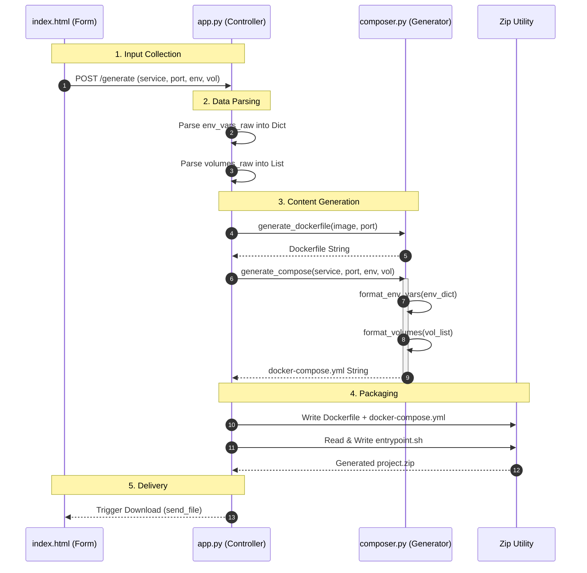

```mermaid
sequenceDiagram
    autonumber
    participant UI as index.html (Form)
    participant App as app.py (Controller)
    participant Comp as composer.py (Generator)
    participant Zip as Zip Utility

    Note over UI, App: 1. Input Collection
    UI->>App: POST /generate (service, port, env, vol)
    
    Note over App: 2. Data Parsing
    App->>App: Parse env_vars_raw into Dict
    App->>App: Parse volumes_raw into List

    Note over App, Comp: 3. Content Generation
    App->>Comp: generate_dockerfile(image, port)
    Comp-->>App: Dockerfile String

    App->>Comp: generate_compose(service, port, env, vol)
    activate Comp
    Comp->>Comp: format_env_vars(env_dict)
    Comp->>Comp: format_volumes(vol_list)
    Comp-->>App: docker-compose.yml String
    deactivate Comp

    Note over App, Zip: 4. Packaging
    App->>Zip: Write Dockerfile + docker-compose.yml
    App->>Zip: Read & Write entrypoint.sh
    Zip-->>App: Generated project.zip

    Note over App, UI: 5. Delivery
    App-->>UI: Trigger Download (send_file)
```
